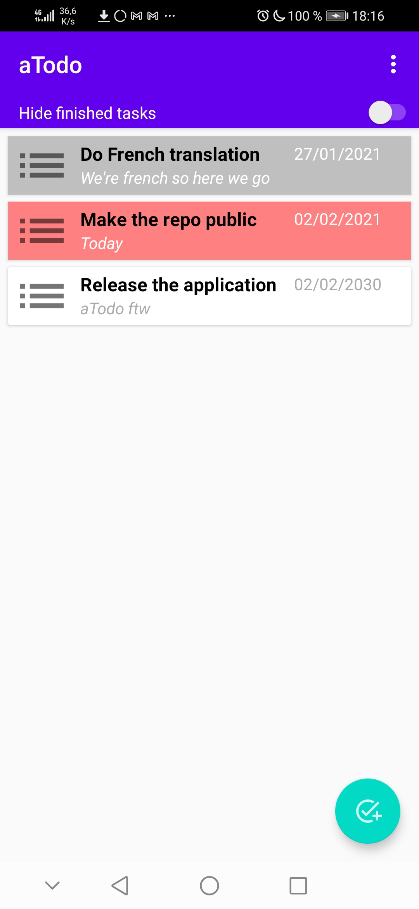
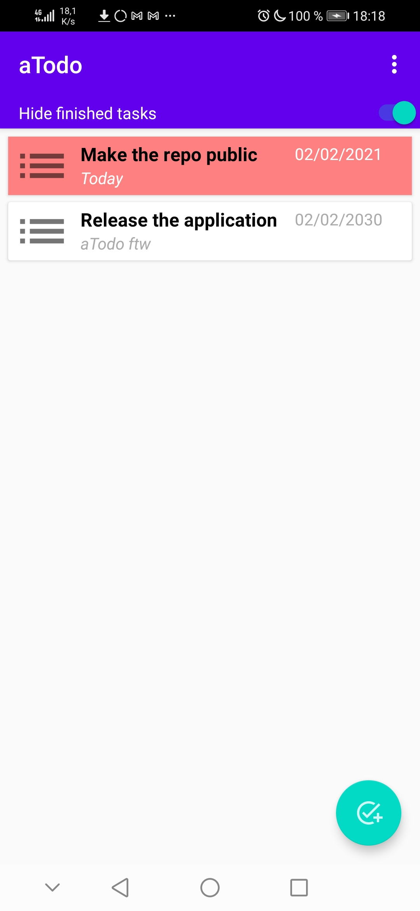
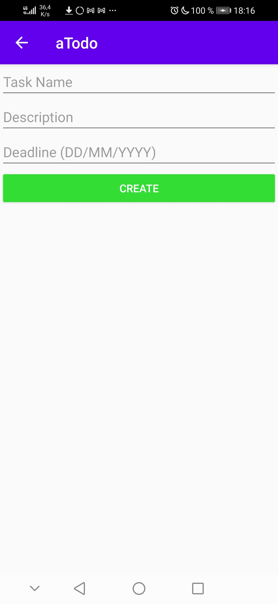
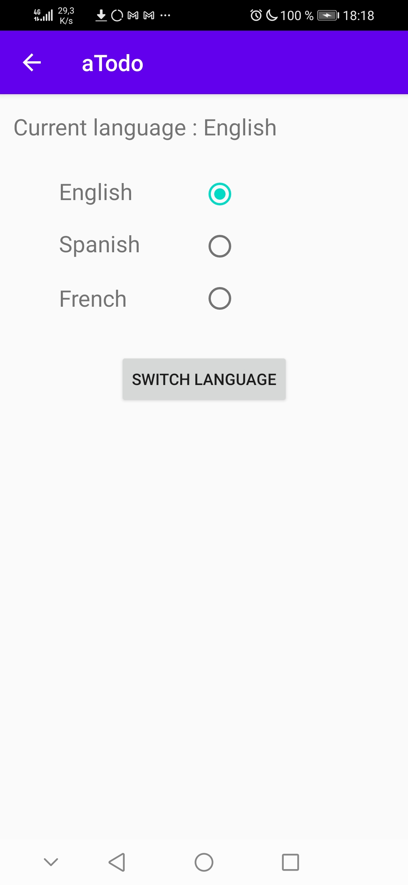

# aTodo

aTodo is an Android 9 application allowing to create todo lists, made for a school project.

## What is it?

This application is a todo list : you can create tasks and mark them as finished or not. \
The background color of the tasks depends on its state : red is late, gray is finished and white is normal state. \
All the data is saved in the phone, the application contains no telemetry.

## Screenshots

### Main Activity

### Main Activity (finished tasks hidden)

### Create Task Activity

### Change Language Activity

Antoine "AntoineJT" Tournepiche & Fadgiras
